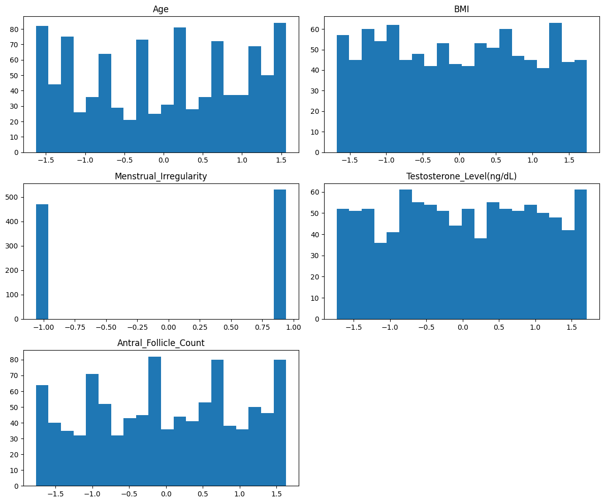
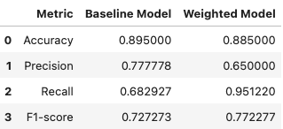
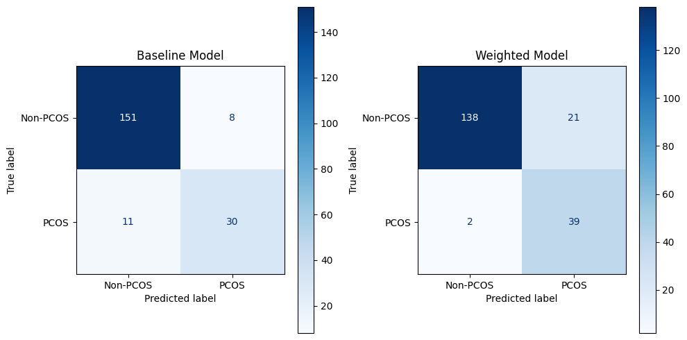

# PCOS Diagnosis Prediction Project

This repository outlines my process to use a linear regression model to predict PCOS diagnoses using "PCOS Diagnosis Dataset" from Kaggle, found [here](https://www.kaggle.com/datasets/samikshadalvi/pcos-diagnosis-dataset?resource=download)

## Overview

The task, as defined by the Kaggle challenge is to use a dataset containing PCOS patient data containing 6 features, to predict PCOS diagnosis. The approach in this repository follows a simple linear regression model and an iteration of this model with hyperparameter adjustments. This model was able to identify 95% of women with a PCOS diagnosis. As of the time this was written, the best recall performance on Kaggle is 96%. 

## Summary of Workdone

### Data

* Data:
  * Type: CSV file of entirely numerical features
  * Size: 1000 rows of unique entries
  * Instances (Train, Test, Validation Split): 800 patients for training, 200 for testing, none for validation

#### Preprocessing / Clean up

* Data was scaled for normalization purposes

#### Data Visualization

The histograms show that there are a couple binary categories, such as Menstrual_Irregularity. Upon further examination, the features are relatively well spread out across their respective ranges.

### Problem Formulation

* Input: features in dataset ('Age', 'BMI', 'Menstrual_Irregularity', 'Testosterone_Level(ng/dL)', 'Antral_Follicle_Count')
* Output: PCOS diagnosis prediction
* Models:
  * I attemped only a linear regression model, since the data was too simple for more complex models
* I chose to adjust the class_weight hyperparameter, since there is a noticable imbalance between class_0 and class_1

### Training

* Software: I trained the model using Python within a Jupyter Notebook environment. The libraries used include:
   * pandas and numpy to manipulate data
   * sci-kit learn to build models
   * matplotlib and seaborn to create visualizations
* Hardware: All training and testing was done on my personal MacBook Air
   * Training was incredibly quick, since the dataset was so small
   * There were no significant difficulties I encountered, since the initial dataset was clean and well-prepared

### Performance Comparison

* I chose recall as my key performance metric

The table below displays the evaluation metrics for both model iterations

The visualizations below show the confusion matrices for both model iterations

### Conclusions

* Using weights in the class_balance hyperparameter greatly increased model recall performance, however I don't believe that this is entirely reliable, as the dataset is hindered by it's small size and class imbalances.

### Future Work

* I would like to try more models for this dataset, such as KNN
* I would also like to try different techniques for creating synthetic data to 1. have more data to work with, and 2. handle class imbalances

### Overview of files in repository

* File descriptions:
  * initial_look.ipynb: Takes CSV file and returns basic exploratory data analysis
  * data_visualization.ipynb: Takes the input data and creates histograms based on target classes
  * data_preprocessing.ipynb: Handles all preprocessing steps necessary for model training
  * baseline_model.ipynb: Trains the baseline model and provides evaluation metrics/confusion matrix
  * model_iteration: Trains the iterative model and provides evauluation metrics/confusion matrix

